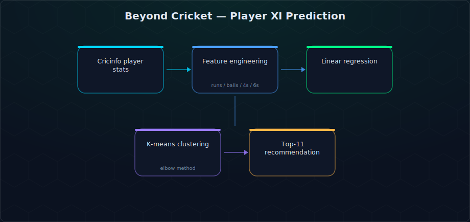
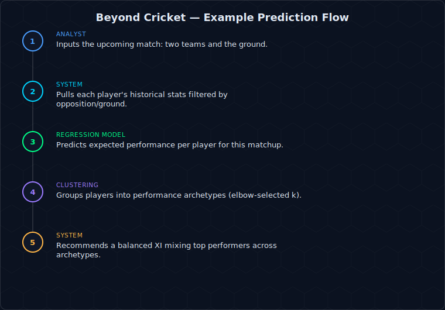

# Beyond Cricket — Fantasy XI Player Prediction


A data-driven recommender for fantasy cricket: given two teams and a ground, predict the 11 best-performing players using historical batting statistics.

## Demo


## What it does

Player performance data — innings played, runs scored, balls faced, boundaries hit — is pulled from Cricinfo and used to train a **Linear Regression** model that predicts expected performance based on opposition and ground conditions. A separate **K-Means clustering** step (with cluster count chosen via the elbow method) groups batsmen into four performance archetypes, helping surface diverse, complementary picks rather than just the highest-scoring names.



## Key features

- **Feature set**: innings played, runs scored, balls faced, 4s and 6s hit, opposition, ground
- **Linear Regression** to estimate expected performance against a specific opposition/ground combination
- **K-Means clustering** (elbow-method-selected *k*) to identify distinct batsman performance categories
- **Validation pass** on the regression model to check prediction reliability before recommending a final XI

## User flow



### Sample output *(illustrative — example formatting, not a live run)*

| Player | Predicted Runs | Archetype Cluster | Recommended? |
|---|---|---|---|
| Player A | 64 | Aggressive starter | ✅ |
| Player B | 41 | Anchor | ✅ |
| Player C | 22 | Lower-order hitter | — |
| Player D | 58 | Aggressive starter | ✅ |

## Real-world application

This is the same recommendation pattern behind fantasy-sports optimizers (the category DFS platforms like Dream11/FanDuel sit in): combine a performance-prediction model with a diversity constraint (here, the K-Means archetypes) so the output isn't just "the 11 highest predicted scorers," which tends to be both repetitive and risky. Pairing prediction with clustering is the actual lesson of the project — point estimates alone aren't enough for a selection problem.

## Tech stack

`Python` · `pandas` · `scikit-learn (Linear Regression, K-Means)` · `matplotlib`

## Repository structure

```
Player11prediction/
├── 5340_final.ipynb       # Full analysis: data prep, regression, clustering
└── 5340_Final.pptx        # Project presentation
```

## Setup

```bash
git clone https://github.com/ananthakrishna4747/Player11prediction.git
cd Player11prediction
pip install pandas scikit-learn matplotlib jupyter
jupyter notebook 5340_final.ipynb
```

## Sample output


## Roadmap

- [ ] Wrap the trained model behind a small FastAPI/Flask prediction endpoint (currently notebook-only)
- [ ] Containerize with Docker for a reproducible run environment
- [ ] GitHub Actions workflow to retrain on newly scraped match data on a schedule

## License

No license file is currently included in this repository — treat as coursework/educational project code.
